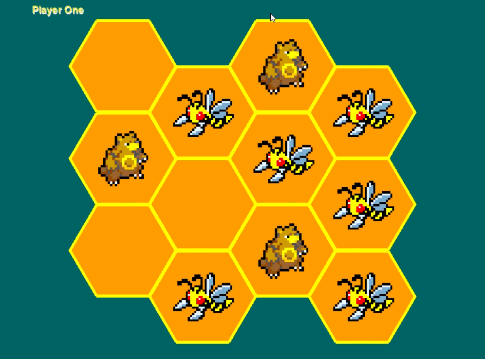

<h1 align="center">Dominate Or Decease</h1> 

<h2 align="center">
    <a href="https://github.com/LandonBisson">Landon Bisson</a> &nbsp&nbsp&nbsp
    <a href="https://github.com/nikocalabro">Niko Calabro</a> &nbsp&nbsp&nbsp
</h2>

<hr>

## Description
Honey Defender is an original two-player turn-based game that can be played by humans or a Reinforcement Learning model. One player controls all bear tokens, and the other player controls all bees. The goal of the game is to push off all but one of the enemy tokens from the hexagonal board. On a player’s turn, they can choose to move in any of 6 directions that do not move their piece off the board. 


## Gameplay

Below is a video demo of two AIs playing against each other for training. We set up a punishment/reward systems to reward AIs for obtaining positions in the middle, killing, and staying alive.  



## Repository Structure
```
honey-defender/
    ├── README.md
    └── src/
        ├── ai_player.py
        ├── board.py
        ├── constants.py
        ├── game_manager.py
        ├── human_player.py
        ├── main.py
        ├── player_base.py
        └── utilities.py
```
